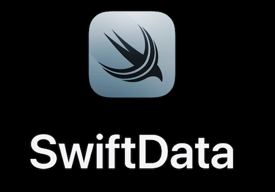

# swift-data

SwiftData is a fast, powerful, and easy-to-use wayto store data in apps built for iOS, macOS, tvOS, watchOS, and even visionOS.

Here in this Swift Data Example I have done CRUD Opration using newly introduced Swift Data Concepts.

Basic Of Code Description :

Model Container : An object that manages an app’s schema and model storage configuration. Model Container is set in WindowGroup. We can pass multiple data models over there.

ModelContext : An object that enables you to fetch, insert, and delete models, and save any changes to disk.Everything in SwiftData happens with model context.It is basically like view context in CoreData.

@Model : Model your data using regular Swift types with @Model, with no additional files or tools to manage. SwiftData can automatically infer many relationships and you can use clear declarations

@Query : Use @Query in your SwiftUI views to fetch data. SwiftData and SwiftUI work together to provide live updates to your views when the underlying data changes, with no need to manually refresh the results.

@Bindable : Use this property wrapper to create bindings to mutable properties of a data model object that conforms to the Observable protocol. 

